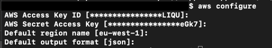

**ATTENTION:** This is currently a work in progress. Please check back when the course is complete

# TechLab-Managed-Cluster-Automation
Partner Program Tech Lab - Automate tenant, usergroup and user creation and auto deploy OneAgent to new tenant.

The goals of this tutorial are;
1. **Tenant Management** Automatically create tenants on a managed cluster. Useful for onboarding new customers, training events, creating additional environments etc.
2. **User Group Management** Automtically create User Groups with the correct access to your freshly created tenant. Useful for onboarding new users, training events and user management.
3. **User Management** Automtically create Users and assign them to the correct user group. Useful for onboarding new users, training events and user management.
4. **API token Management** Automatically create API tokens with the correct roles. Useful for automated Oneagent deployments, integrations, training events, key rotation etc.
5. **Automated OneAgent Deploymentt** Start ec2 instances and automatically install and configure the OneAgent. Useful for fast deployments of the OneAgent and ensuring new resources are implemented. 

First we will run these setps individually so you get a feel for how they operate then we will provide a script that allows you to do it all at once.

## Pre-Requisites
1. You need an AWS account. If you don't have one [get one here](https://aws.amazon.com/)
1. AWS CLI v1 or v2 [installed](https://docs.aws.amazon.com/cli/latest/userguide/install-cliv2.html) and [configured](https://docs.aws.amazon.com/cli/latest/userguide/cli-chap-configure.html) to your account. 
1. You need a Dynatrace Managed Cluster license. If you don't have one each out to .... to be granted a trial license.
1. You need a Managed Cluster. A single trial node is sufficient. Thic could be run on a VM or in your EC2 account [view specs](https://www.dynatrace.com/support/help/setup-and-configuration/dynatrace-managed/installation/dynatrace-managed-hardware-and-system-requirements/)
1. Optional: ActiveGates - depending on your install and security requirements you may also require a CLuster and Environment ActiveGate
1. You need to clone or copy the content of this GitHub repo to your local disk!

## Preparation

**Amazon Web Services (AWS)**

As we are going to use AWS EC2. We have tested this tutorial on eu-west-1 (Ireland). To be on the safe side we suggest you pick this region!
Ensure you have installed the AWS CLI and configured it.

