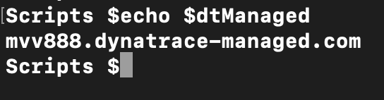

**ATTENTION:** This is currently a work in progress. Please check back when the course is complete

# 1. Overview
Hello and welcome to this Dynatrace Partner TechLab. We are launching these as self-paced training for all our partners. During this session we will focus on automation and complete hands on exercies on how to automate creating a monitoring environment, usergroup and user and auto deploy OneAgent to the new environment.

The goals of this tutorial are;
1. **Tenant Management** - Automatically create tenants on a managed cluster. Useful for onboarding new customers, training events, creating additional environments etc.
2. **User Group Management** - Automtically create User Groups with the correct access to your freshly created tenant. Useful for onboarding new users, training events and user management.
3. **User Management** - Automtically create Users and assign them to the correct user group. Useful for onboarding new users, training events and user management.
4. **API token Management** - Automatically create API tokens with the correct roles. Useful for automated Oneagent deployments, integrations, training events, key rotation etc.
5. **Automated OneAgent Deployment** - Start ec2 instances and automatically install and configure the OneAgent. Useful for fast deployments of the OneAgent and ensuring new resources are implemented. 

First we will run these setps individually so you get a feel for how they operate then we will provide a script that allows you to do it all at once.

## Pre-Requisites
1. You need an AWS account. If you don't have one [get one here](https://aws.amazon.com/)
1. AWS CLI v1 or v2 [installed](https://docs.aws.amazon.com/cli/latest/userguide/install-cliv2.html) and [configured](https://docs.aws.amazon.com/cli/latest/userguide/cli-chap-configure.html) to your account. 
1. You need a Dynatrace Managed Cluster license. If you don't have one each out to .... to be granted a trial license.
1. You need a Managed Cluster. A single trial node is sufficient. Thic could be run on a VM or in your EC2 account [view specs](https://www.dynatrace.com/support/help/setup-and-configuration/dynatrace-managed/installation/dynatrace-managed-hardware-and-system-requirements/)
1. Optional: ActiveGates - An ActiveGate is not required to complete these exercises but depending on your install and security requirements you may also require a CLuster and/or Environment ActiveGate. For more info see [When do I need to install an ActiveGate?](https://www.dynatrace.com/support/help/setup-and-configuration/dynatrace-activegate/basic-concepts/when-do-i-need-to-install-an-activegate/)
1. [Curl](https://curl.haxx.se/dlwiz/?type=bin) & [JQ](https://stedolan.github.io/jq/download/) installed
1. You need to clone or copy the content of this GitHub repo to your local disk!

## Preparation

**Amazon Web Services (AWS)**

As we are going to use AWS EC2. We have tested this tutorial on eu-west-1 (Ireland). To be on the safe side we suggest you pick this region!
Ensure you have installed the AWS CLI and configured it.

**Dynatrace**

You will need to have provisioned your dynatrace managed cluster. For installation instructions please follow the [documentation](https://www.dynatrace.com/support/help/setup-and-configuration/dynatrace-managed/installation/set-up-a-cluster/)

Once you have have your cluster provisioned we need a couple of things
1. Your dynatrace managed URL. That should look something like `https://xxxxxx.dynatrace-managed.com`
2. Cluster API token. Inside CMC go to Settings -> API tokens -> Cluster tokens and select Generate token. Grant it the scope of Service Provider API

Expand the token and copy the API key

# 2. Manage your monitoring environments

**What is a monitoring environment?**

Your Dynatrace monitoring environment is where all your Dynatrace performance analysis takes place. Dynatrace OneAgent sends all captured monitoring data to your monitoring environment for analysis. A monitoring environment is analogous to an analysis server that provides all Dynatrace application-performance analysis functionality, including all dashboards, charts, reports and other tools.
It's common to set up multiple monitoring environments so that related entities can be grouped for discrete analysis. For example, you might set up one monitoring environment to monitor and analyze the performance of your production clusters. You might set up a second environment that's dedicated to the performance of your developers' machines and a third environment for your staging servers.
You might also be running managed as a service for your customers. In that case you would setup separate environments for each customer to ensure their data is segrated.

Monitorining environments can be created using the Cluster Management Console but this can be cumbersome if you have a large amount to manage.

In this exercise we will create a new monitoring environment and assign the appropriate license limits to it via an API call.

**Create a new monitoring environment?**

To create a new monitoring environment ensure you have set-up your managed cluster, have generated a Cluster API Token and installed CURL and JQ in your prefered command line tool.

1. Issue the following commands, ensuring to update them with your managed URL and Cluster API token. Do not include the 'https://'

`export dtManaged=xxxxx.dynatrace-managed.com`
`export dtAPI=xxxxxxxxxxxxxxxxx`

Check the values are correctly set

'echo $dtManaged' the output should look like

